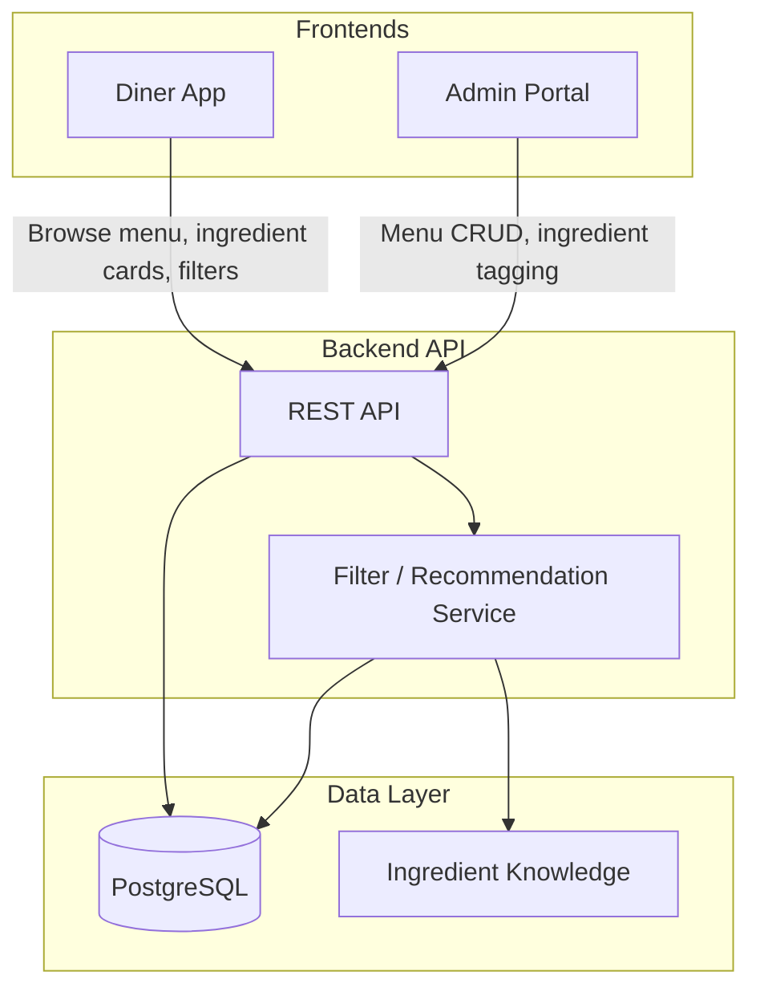

# Tech Stack

- **Frontend:** React 18 + TypeScript, Vite for build; Framer Motion for transitions; Tailwind CSS for styling. Two apps: `diner-app` (customer-facing) and `admin-portal` (restaurant management).
- **Backend:** Node.js + Express (or FastAPI if Python preferred); REST API; optional server-side sessions or JWT for auth.
- **Database:** PostgreSQL for relational data (restaurants, menus, dishes, ingredients, users, user_restrictions); single shared DB for both apps.
- **Deployment:** Docker for backend + DB; frontends as static builds (e.g. Vercel/Netlify or same host). No GCP/Framer hosting specified in spec—flexible.
- **Other tools:** Vitest for unit/integration tests; Playwright for E2E on critical flows (menu browse, admin CRUD); seed/migration scripts for ingredient dictionary.

# Architecture Overview



- **Component relationships:** Both frontends talk only to the Backend API. API owns all DB access and encapsulates ingredient knowledge (ingredients + aliases). Filter/recommendation logic compares `user_restrictions` with `dish_ingredients` (per restaurant) and marks or filters dishes.

# File Structure

```
digital-menu/
├── backend/                 # Node + Express (or FastAPI)
│   ├── src/
│   │   ├── routes/          # restaurants, menus, sections, dishes, ingredients, users, auth
│   │   ├── services/        # menu CRUD, ingredient lookup, filtering logic
│   │   ├── db/              # schema, migrations, client
│   │   └── middleware/      # auth, validation
│   ├── package.json
│   └── Dockerfile
├── diner-app/               # React + Vite + TS
│   ├── src/
│   │   ├── pages/           # menu, section list, dish detail
│   │   ├── components/      # ingredient card modal, filter panel, dish list
│   │   ├── api/             # client to backend
│   │   └── store/           # optional state (e.g. user prefs, filters)
│   └── package.json
├── admin-portal/            # React + Vite + TS
│   ├── src/
│   │   ├── pages/           # menu editor, section/dish CRUD
│   │   ├── components/      # ingredient picker (search/suggestions), dish form
│   │   └── api/
│   └── package.json
├── shared/                  # optional: shared TS types / constants
│   └── types/
├── data_resources/          # existing FoodData Central / Wikimedia
├── main_ideas.txt
└── TECH_PLAN.md
```

# Key Components & Implementation Steps

1. **Database schema and migrations**
   Purpose: Single source of truth for restaurants, menus, menu_sections, dishes, ingredients, ingredient_aliases, dish_ingredients (junction: dish + ingredient per restaurant), users, user_restrictions. Enforce “dish ingredients belong to restaurant’s version of dish” (FK from dish to restaurant/menu context). Files: `backend/src/db/schema.sql`, migration runner (e.g. node-pg-migrate or similar).
2. **Ingredient dictionary (knowledge layer)**
   Purpose: CRUD and lookup for canonical ingredients (name, aliases, short description, image; translations out of MVP). Used by admin for tagging and by diner app for cards. Files: `backend` routes/services for ingredients + aliases; seed script using `data_resources` if desired. Admin: ingredient picker with search/suggest by name and alias.
3. **Restaurant menu editor (admin portal)**
   Purpose: Create/edit menu sections and dishes (name, description, price, image); attach ingredients to dishes via search/suggest. Publish menu. Files: `admin-portal` pages (menu/section/dish), components (dish form, ingredient picker), API client; `backend` routes for menus, sections, dishes, dish_ingredients.
4. **Diner menu interface**
   Purpose: Browse restaurant menu (sections, dishes). Public or per-restaurant URL. Files: `diner-app` pages (restaurant menu, section list, dish detail), components (dish list, section nav), API client; `backend` read-only menu endpoints.
5. **Ingredient explanation cards**
   Purpose: Click/tap ingredient on dish → modal/card with canonical name, description, image (aliases in MVP optional). Data from ingredient knowledge layer. Files: `diner-app` component (e.g. IngredientCardModal), API endpoint for ingredient by id or slug.
6. **User profile and restrictions**
   Purpose: Optional login; store restrictions (allergy, dislike, diet) linked to user. Files: `backend` auth (e.g. JWT/sessions), routes for users and user_restrictions; `diner-app` profile/settings UI and API client.
7. **Filtering and recommendation labels**
   Purpose: Compare user_restrictions to dish_ingredients (per dish per restaurant); hide or flag dishes (e.g. “Contains peanut” for allergy). Files: `backend` service that joins dish_ingredients → ingredients and user_restrictions; endpoint for “menu with filter applied” or “labels per dish”; `diner-app` filter panel and dish badges/warnings.

# Constraints & Patterns

- **Testing:** Target >80% coverage; Vitest for backend and frontend unit/integration; Playwright for E2E (e.g. view menu, open ingredient card; admin: create dish, attach ingredient).
- **Styling:** Tailwind CSS across both apps; consistent design tokens; Framer Motion only where it adds clarity (modals, list transitions).
- **Security:** Auth for admin (restaurant-scoped) and optional diner login; JWT or session cookies; validate ownership (restaurant can only edit own menus). No medical advice—allergy warnings are informational only.
- **Performance:** Lazy load dish images; debounce ingredient search in admin; paginate or virtualize long menu lists if needed; index DB on (dish_id, ingredient_id), (user_id), and menu/section FKs.

# Open Questions

1. **Auth scope for MVP:** Should restaurant staff use email/password per restaurant, or a single global admin with restaurant selection? Any SSO (e.g. Google) required for diners?
2. **Ingredient data source:** Use only manual entry in admin, or seed from FoodData Central / Wikimedia (you have CSVs and token) and map to canonical ingredients? If seed, who maintains mappings?
3. **Restaurant discovery:** How does a diner land on a menu—fixed single restaurant, slug (e.g. `/menu/:restaurantSlug`), or multi-tenant list of restaurants? Affects routing and API shape.
4. **Hosting preference:** Any requirement for Docker Compose only, or are you open to managed DB (e.g. Supabase/Neon) + serverless/VM for API and static hosting for frontends?
5. **Filtering UX:** Should restricted dishes be hidden by default, or shown with a clear “Contains X” / “Not suitable for your diet” label and let the user decide?

---

_This is the full content for [TECH_PLAN.md](TECH_PLAN.md). After you confirm the plan, the next step is to create the file `TECH_PLAN.md` in the project root with this content (when not in plan mode)._
